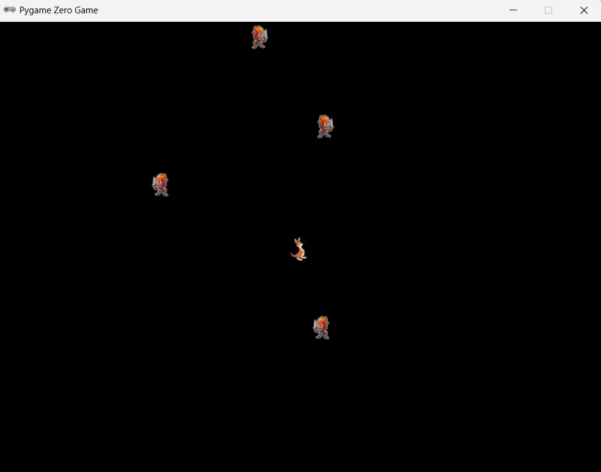

**Fuja, Kanguru!**


---

## Índice

* [Visão Geral](#visão-geral)
* [Instalação](#instalação)
* [Como Jogar](#como-jogar)
* [Controles](#controles)
* [Funcionalidades](#funcionalidades)
* [Estrutura de Arquivos](#estrutura-de-arquivos)
* [Melhorias e Insights](#melhorias-e-insights)
* [Licença](#licença)

---

## Visão Geral

`Fuja, Kanguru!` é um pequeno jogo roguelike 2D desenvolvido com **Pygame Zero**. O jogador controla um herói que deve desviar de inimigos que se movem aleatoriamente pela tela. Ao colidir, o jogo emite um som de morte e retorna ao menu principal.

---

## Instalação

1. **Requisitos**:

   * Python 3.7+ (Utilizado Py 3.13)
   * Pygame Zero 1.5+
2. **Clone este repositório**:

   ```bash
   git clone https://repo.git
   cd repo
   ```
3. **Organize seus assets**:

   ```
   seu_projeto/
   ├─ images/
   │  ├─ hero_0.png ... hero_3.png
   │  ├─ hero_right.png
   │  ├─ enemy_0.png ... enemy_3.png
   │  └─ enemy_right.png
   ├─ music/
   │  └─ theme.mp3
   │  └─ die.mp3
   └─ platformer_game.py
   ```
4. **Instale dependências**:

   ```bash
   pip install pgzero pygame
   ```

---

## Como Jogar

* Execute o jogo:

  ```bash
  pgzrun platformer_game.py
  ou
  python -m pgzero platformer_game.py
  ```
* No menu, clique em **Start** para iniciar.
* Desvie dos inimigos até ser atingido.
* Ao colidir, o som de morte toca e você retorna ao menu.
* Use **Music** para ativar/desativar a trilha de fundo.

---

## Controles

* **←, →, ↑, ↓**: mover o herói
* **Clique Start**: iniciar partida
* **Clique Music**: ligar/desligar trilha
* **Clique Quit**: fechar o jogo

---

## Funcionalidades

* **Menu interativo**: botões Start, Music (On/Off) e Quit.
* **Movimentação do herói** com animação de caminhada.
* **Inimigos auto-pilotados**: movem-se aleatoriamente e ricocheteiam nas bordas.
* **Sprites direcionais**: herói e inimigos mudam de imagem quando vão para a direita.
* **Sistema de áudio**:

  * Trilha de fundo em loop (`theme.mp3`).
  * Efeito de "die" tocado ao colidir.

---

## Estrutura de Arquivos

```plaintext
seu_projeto/
├─ images/ # PNGs
├─ music/  # Sounds
└─ platformer_game.py # código-fonte
```

---

## Melhorias e Insights

**Áudio**:

* Se a opção **Music** estiver desligada, não deve tocar o efeito de morte.

  * Solução: verificar flag `music_on` antes de `sounds.die.play()`:

  ```python
  if music_on:
      sounds.die.play()
  ```
* Ajustar volumes de trilha e efeitos de forma independente.
* Adicionar sons de passos ou pulos para feedback extra.

**Animação e Movimentação**:

* **Sprites completos**: atualmente só há um frame direito para ataques; criar múltiplos frames de `hero_right_0`, `hero_right_1` para animação mais fluida.
* **Elasticidade**: implementar *tweening* de ossos (ex.: braço e perna balançando) usando interpolação de posições ou um sistema simples de *sway*.
* **Direções adicionais**: suportar sprites para cima e para baixo (3 direções) em vez de apenas esquerda/direita.
* **Comportamento inimigo**: variar padrões de movimento (patrulha, perseguição instintiva do herói, teleportar ocasionalmente).

**UX/UI**:

* Mostrar efeitos visuais de colisão (flash, particulas).
* Tela de pontuação com tempo sobrevivido.

---

## Licença

MIT © Tiagão
